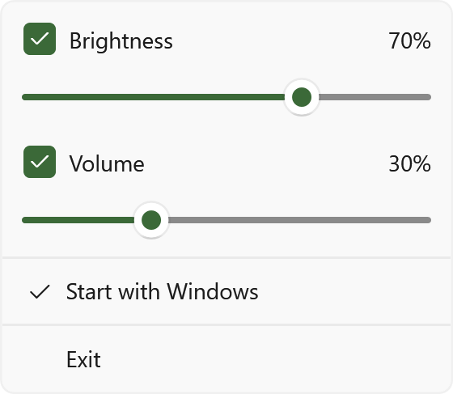
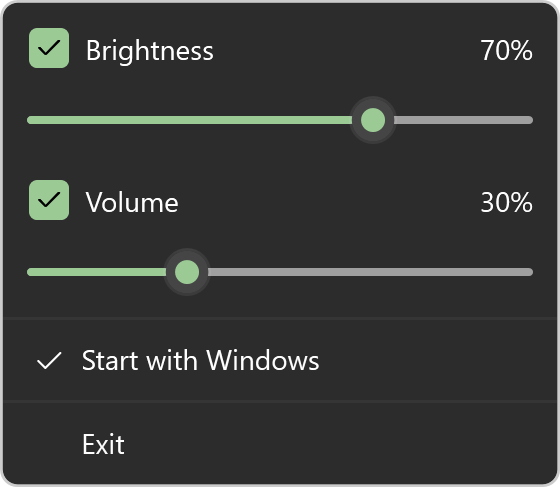

# MonitorSync

Use your keyboard's brightness and volume keys to control your monitor on Windows 11.

- **Brightness keys** adjust the screen under your mouse cursor. **Ctrl+Alt+Page Up / Page Down** is available as a fallback.
- **Volume keys** keep Windows and the selected monitor speakers in sync.

The tray menu adds sliders and lets you turn either control on or off.

| Light | Dark |
| --- | --- |
|  |  |

[Download and run the MSI installer](https://github.com/nkatchik/win-monitor-sync/releases). MonitorSync starts automatically in the tray, with **Start with Windows** enabled by default. No setup window.

Requires a monitor with DDC/CI enabled and a supported keyboard for brightness keys. Preview builds are unsigned.

[Build instructions](docs/BUILDING.md) · [Compatibility and testing](docs/TESTING.md) · [Design](DESIGN.md) · [License](LICENSE)
